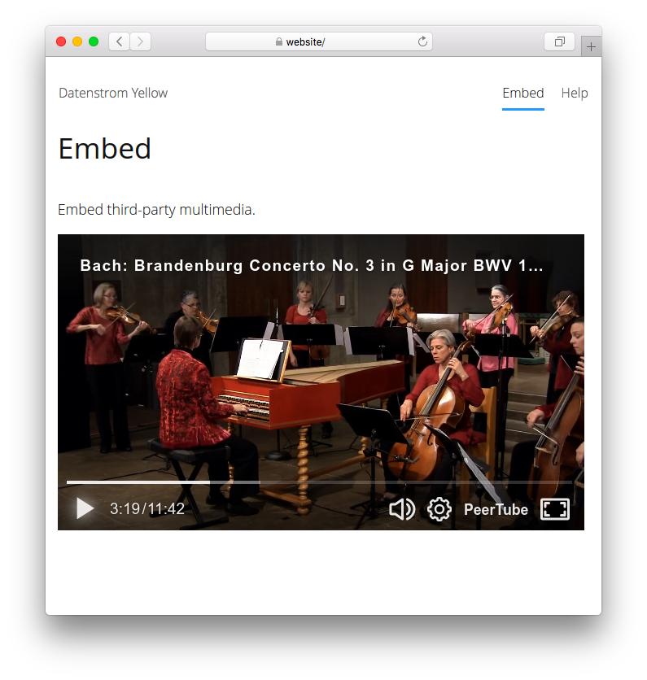

# Embed 0.9.1

Embed third-party multimedia.

## How to install an extension

[Download ZIP file](https://github.com/GiovanniSalmeri/yellow-embed/archive/refs/heads/main.zip) and copy it into your `system/extensions` folder. [Learn more about extensions](https://github.com/annaesvensson/yellow-update).

## How to embed a multimedia file

Create an `[embed]` shortcut. 

The following arguments are available, all but the first two arguments are optional:
 
`Service` = multimedia service  
`Source` = multimedia source identifier; the source identifier is generally the last part of the link with which the multimedia file is accessed; if more parts are required (e.g. site and identifier), separate them with `/`  
`Style` = multimedia style, e.g. `left`, `center`, `right`; ignored for services defined with full width and fixed height  
`Width` = multimedia width, pixel or percent  
`Height` = multimedia height, pixel or percent  

## How to define a multimedia service

Multimedia services can be defined in `system/extension/embed.ini`. The file comes with several types predefined, you can add more of them. Write the name of the service, followed by `:` and the URL of the content to embed. You can get the URL to use from the share command in the various services. The following placeholders are available:

`@1`, `@2`...: first, second... part of the source identifier  
`@lang`: language of the page  

If the content should normally occupy the full width of the page and have a fixed height in pixels, add this latter to the URL, separated by a comma.

You should know that most third-party services collect personal data and use cookies. Prefer services that respect your privacy and that of your visitors.

## Examples

Embedding a multimedia file, different sources:

    [embed peertube videos.domainepublic.net/ofnMshcdf8c8sNbVA8XGmf]
    [embed dailymotion x8fdwjh]
    [embed mixcloud todomundo/david-byrne-radio-presents-mali]
    [embed vimeo 88245710]
    [embed tedtalks manoush_zomorodi_how_boredom_can_lead_to_your_most_brilliant_ideas]
    [embed youtube e99D0gnqG-c]

Embedding a multimedia file, different sizes:

    [embed dailymotion x8fdwjh right 50%]
    [embed dailymotion x8fdwjh right 200 112]
    [embed dailymotion x8fdwjh right 400 224]

Defining a service in `embed.ini`:

    vimeo: https://player.vimeo.com/video/@1?dnt=1&texttrack=@lang&portrait=0

Defining a service in `embed.ini`, full width and fixed height of 150px:

    funkwhale: https://@1/front/embed.html?type=track&id=@2, 150

## Settings

The following setting can be configured in file `system/extensions/yellow-system.ini`:

`EmbedStyle` = multimedia style, e.g. `flexible`  

## Acknowledgements

This extension is based on Youtube (now discontinued) by Anna Svensson. Thank you for the good work. This extension uses various multimedia sources. Thank you for the free services.

## Developer

Giovanni Salmeri. [Get help](https://datenstrom.se/yellow/help/).
